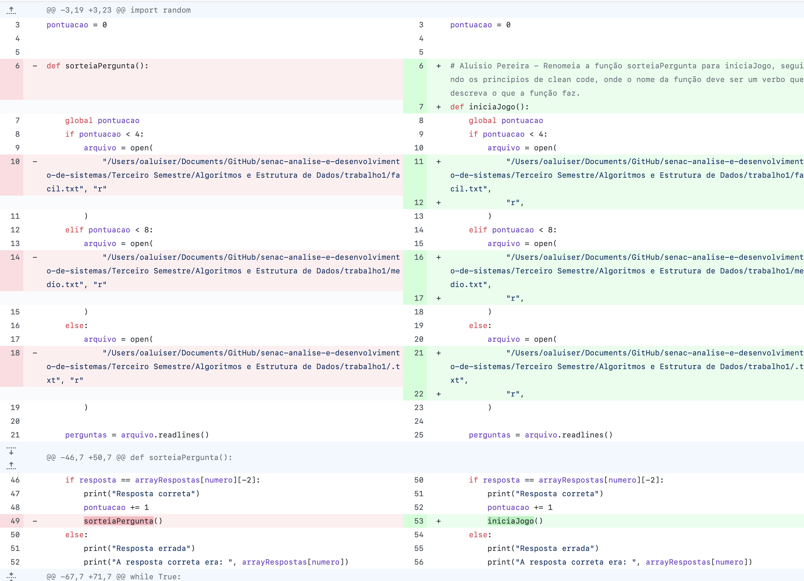
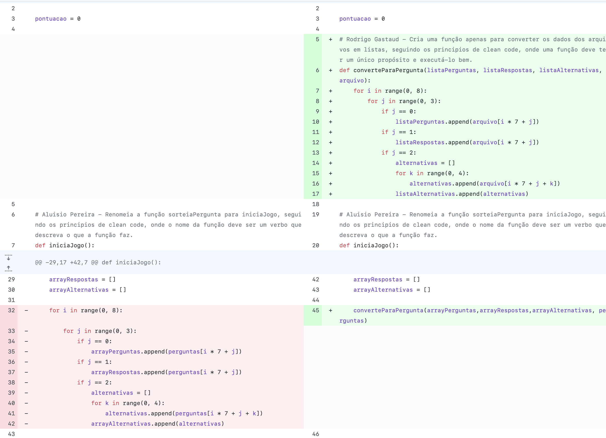
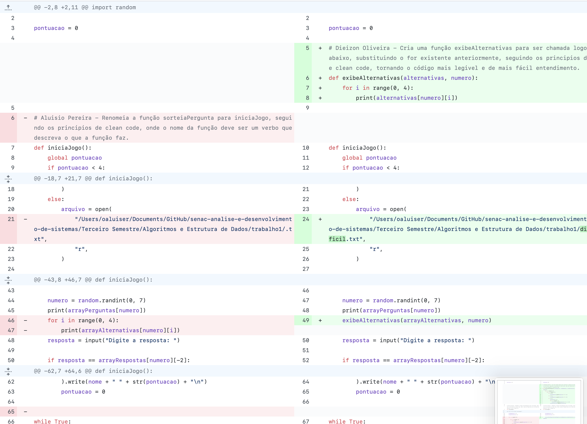
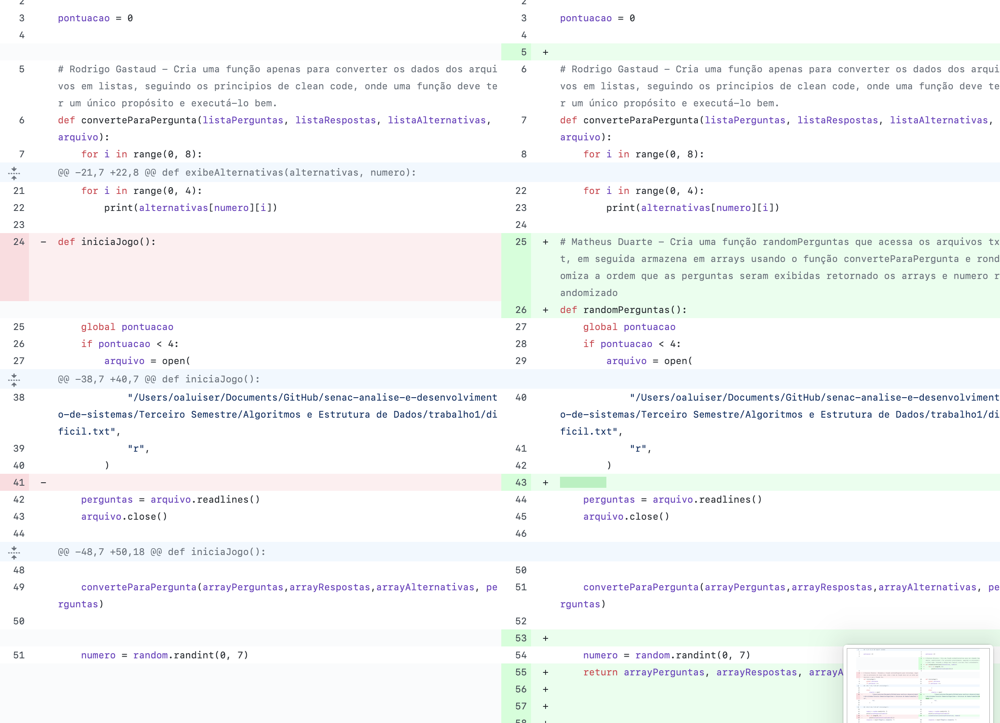
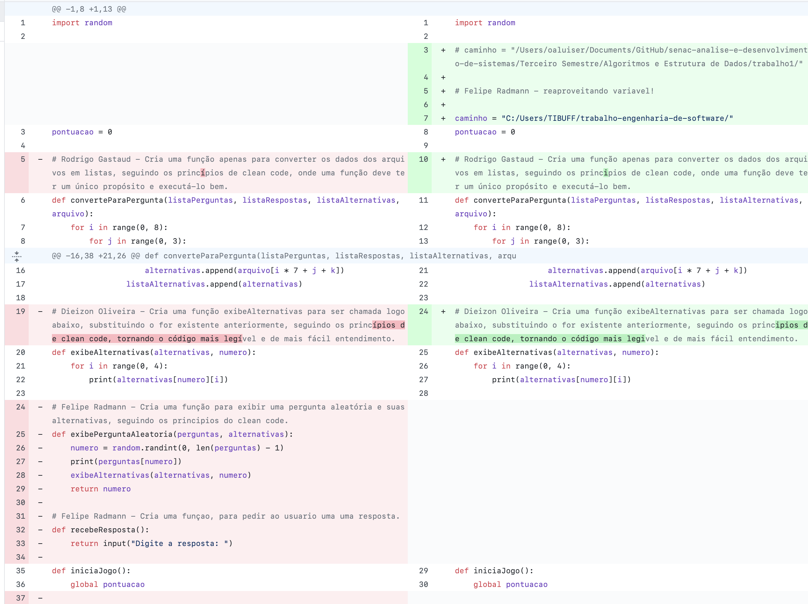
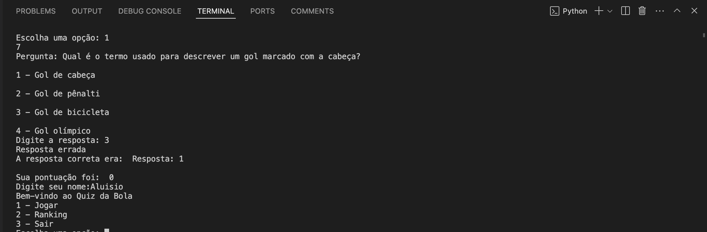

# Prints dos códigos sujos e posteriormente refatorados

# Descrição da ferramenta de testes utilizada

O código foi testado manualmente através do terminal do Visual Studio Code, onde foi possível visualizar o resultado de cada função.

# Forma de configuração e instalação

Para rodar o código, basta clonar o repositório e executar o arquivo `main.py` no terminal.

# Prints dos testes realizado

